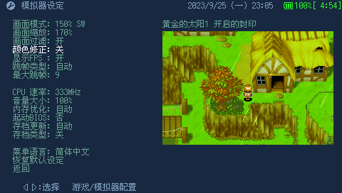

# TempGBA4PSP-cc
## 基于TempGBA4PSP-mod修改，优化点：
1. 支持画面颜色修正（从libretro gpsp移植），避免颜色过于鲜艳失真，对性能有轻微影响（几帧）；
2. 支持中文文件名，统一4种语言字符串编码到GBK，删除只支持日语的冗余代码和字库；
3. 支持开关从ROM读取存档类型功能，默认关闭，解决部分ROM不能存档问题（例如缩小帽）。

## 颜色修正效果对比：
关闭：
开启：

# TempGBA4PSP-mod

Based on this version (TempGBA4PSP-26731020), http://www1.axfc.net/uploader/so/3063963

Added gpsp kai 's cheats function.

Added Chinese language.

Added restore function.

New menu icon.

Impoted code from TempGBA-mod-dstwo-26750220.
